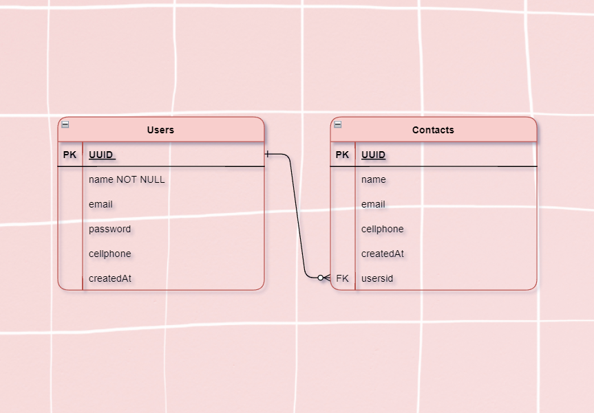

<h1>Bem-vindo ao <strong>Contactool!<strong></h1>

Essa aplicação tem como intuito fazer uma agenda telefônica 100% funcional. Basta fazer seu cadastro, logar e então adicionar quantos contatos quiser; é possível também modificar seu usuário e os outros contatos também, se necessário.

# Backend: 

<h3>Diagrama:</h3>



<h2>Instalação</h2>

Entre no diretório do projeto:
```bash
    cd backend
```

Crie um arquivo chamado `.env` e preencha os requisitos mostrados no exemplo ".env.example"

Instale as dependências:
```bash
    yarn
```
Caso necessário, faça as migrations: 
```bash
    yarn typeorm migration:generate  src/migrations/initial -d src/data-source.ts
    yarn typeorm migration:run -d src/data-source.ts
```

Inicie o servidor:

```bash
    yarn dev
```

# Documentação da API: 

<h3> Criar conta: </h3>
<h4>POST /users/</h4>

```bash
   {
    "name": "Luciana",
    "email": "Luciana12G@gmail.com",
    "password": "Luciana12G",
    "cellphone": "0000000"
    }
```

<h3> Logar na sua conta: </h3>
<h4>POST /login/</h4>

```bash
   {
    "email": "Luciana12G@gmail.com",
    "password": "Luciana12G",
    }
```

<h3> Listar sua conta: </h3>
<h4>GET /users/own/</h4>
<p>Para listar, é necessário apenas o token (recebido ao fazer o login)</p>

<h3> Editar sua conta (podendo modificar nome, número de celular e e-mail): </h3>
<h4>PATCH /users/own/</h4>

```bash
    {
	    "name": "Lucy"
    }
```

<h3> Deletar sua conta: </h3>
<h4>DELETE /users/own/</h4>
<p>Para deletar, é necessário apenas o token (recebido ao fazer o login)</p>


<h3> Criar contato: </h3>
<h4>POST /contacts/</h4>

```bash
{
  "name": "Joana",
  "email": "Joana@gmail.com",
  "cellphone": "4354352"
}
```

<h3> Listar seus contatos: </h3>
<h4>GET /contacts</h4>
<p>Para listar, é necessário apenas o token (recebido ao fazer o login)</p>


<h3> Listar um contato específico: </h3>
<h4>GET /contacts/:id</h4>
<p>Para listar, é necessário apenas o token (recebido ao fazer o login) e colocar na rota o id do contato</p>


<h3>Modificar contato: </h3>
<h4>PATCH /contacts/:id</h4>
<p>Para modificar, é necessário apenas o token (recebido ao fazer o login) e colocar na rota o id do contato</p>

```bash
{
  "name": "Joana",
}
```

<h3> Deletar sua conta: </h3>
<h4>DELETE /users/own/</h4>
<p>Para deletar, é necessário apenas o token (recebido ao fazer o login) e colocar na rota o id do contato</p>

# Frontend:

<p>Em andamento</p>